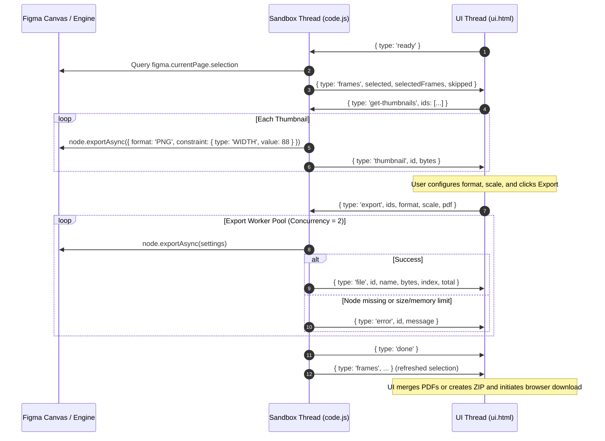

# AGENTS.md — Development & Operational Guide for AI Agents

> **Specification Standard:** Follows the open `AGENTS.md` standard.  
> **Target Audience:** Autonomous coding agents, LLM pair-programmers, and human maintainers.  
> **Last Updated Baseline:** Current project status (offline Figma plugin, single-bundle architecture).

---

## 1. Project Overview & Current Status

**Velto** is a zero-network, high-performance Figma plugin designed to bulk-export canvas frames, components, and component sets to **PNG, JPG, SVG, PDF, or standalone HTML**.

### Key Architectural Tenets
* **Strictly Offline & Sandboxed:** Operates with `"networkAccess": { "allowedDomains": ["none"] }` in `manifest.json`. Zero external HTTP requests, telemetry, or remote CDN dependencies are allowed.
* **Dual-Thread Execution:** Splits responsibilities between the **Figma Sandbox Thread** (`code.js`) and the **UI Iframe Thread** (`ui.html`).
* **Modular Source with Monolithic Assembly:** Development is done across modular files in `src/ui/` and `vendor/`. A lightweight build script (`build_ui.js`) concatenates everything into a single distribution file (`ui.html`).
* **Memory & Performance Conscious:** Employs concurrent export throttling (max 2 workers), cooperative event-loop yielding (`setTimeout(r, 0)`), lazy thumbnail loading with cancellation tokens, and explicit object URL memory revocation (`URL.revokeObjectURL`).
* **Zero Runtime Build Dependencies:** Uses vanilla ECMAScript. No Webpack, Vite, Rollup, or Babel is required to build or run the plugin.

---

## 2. Codebase Architecture & File Map

```
Figma Export Plugins/
├── manifest.json              # Plugin manifest (Figma Plugin API 1.0.0, dynamic-page access)
├── code.js                    # Main thread sandbox (canvas query, export worker pool, IPC)
├── build_ui.js                # Assembly script combining src/ui/ and vendor/ into ui.html
├── ui.html                    # Compiled standalone distribution bundle loaded by figma.showUI()
├── README.md                  # Human-facing documentation and feature screenshots
├── AGENTS.md                  # Machine-readable agent contract, rules, and architecture specs
├── .gitignore                 # Ignores node_modules/, *.log, .DS_Store, Thumbs.db
├── assets/                    # Graphic assets & documentation media
│   ├── logo.svg               # Vector brand icon (512x512)
│   ├── logo.png               # Raster brand image
│   └── screenshots/           # UI walkthrough screenshots (1 through 4)
├── vendor/                    # Self-contained offline third-party libraries
│   ├── jszip.min.js           # JSZip 3.10.1 (MIT) - in-memory archive generation
│   └── pdf-lib.min.js         # pdf-lib 1.17.1 (MIT) - client-side multi-page PDF merger
└── src/
    └── ui/
        ├── templates/
        │   ├── head.html      # Document head, viewport metadata, Google Sora font preconnect
        │   └── body.html      # DOM structure (Select, Settings, Progress views & SVG radar)
        ├── styles/
        │   ├── theme.css      # Design tokens, CSS variables, native light & dark theme styling
        │   └── main.css       # Layout, components, buttons, animations, and radar widget
        └── js/
            ├── state.js       # Global state tree, demo mock data, file planning, sanitization
            ├── thumbnails.js  # Lazy thumbnail requests, blob URL cache & cleanup
            ├── ui-renderer.js # List rendering, selection toggling, screen routing
            ├── exporter.js    # Progress calculations, IPC dispatch, simulation mode
            ├── packaging.js   # Single-file / ZIP packaging (STORE vs DEFLATE), downloads
            ├── pdf-merger.js  # pdf-lib multi-page PDF merger with ZIP fallback
            └── main.js        # DOM event wiring, theme synchronization, message dispatcher
```

### Source File Responsibilities

| File Path | Execution Realm | Responsibility |
| :--- | :--- | :--- |
| `manifest.json` | Figma Host | Declares plugin ID (`1689309576315100317`), main file, UI file, permissions, and zero-network access policy. |
| `code.js` | Sandbox | Direct access to Figma document model (`figma.*`). Listens to selection/page changes, runs concurrent exports, renders 88px thumbnails. |
| `build_ui.js` | Node.js Tool | Reads modular files from `src/ui/` and `vendor/`, wraps them in an IIFE, and writes out `ui.html`. |
| `src/ui/templates/head.html` | UI (Template) | HTML shell, meta tags, and Sora typography import. |
| `src/ui/templates/body.html` | UI (Template) | HTML templates for selection header, frame list, settings segment controls, and circular progress animation widget. |
| `src/ui/styles/theme.css` | UI (Style) | Color palettes and design tokens for light and `.figma-dark` themes. |
| `src/ui/styles/main.css` | UI (Style) | Full styling for layout, interactive states, animated progress radar, and buttons. |
| `src/ui/js/state.js` | UI (Logic) | Manages `state` object, filename collision resolution (`planFiles`), scale calculations, and filename sanitization. |
| `src/ui/js/thumbnails.js` | UI (Logic) | Requests missing thumbnails from sandbox and cleans up object URLs to prevent leaks. |
| `src/ui/js/ui-renderer.js` | UI (Logic) | Renders DOM rows, handles checkbox selection, syncs settings options, and manages view switching. |
| `src/ui/js/exporter.js` | UI (Logic) | Dispatches export commands over IPC, handles incoming file buffers, updates progress percentages, and runs browser simulation if outside Figma. |
| `src/ui/js/packaging.js` | UI (Logic) | Orchestrates single file downloads or JSZip packaging with compression optimization. |
| `src/ui/js/pdf-merger.js` | UI (Logic) | Merges single-page vector PDFs into a single document via `pdf-lib` with automatic fallback to individual ZIP packaging. |
| `src/ui/js/main.js` | UI (Entry) | Binds DOM listeners, applies Figma theme classes, listens to `window.onmessage`, and boots the app. |

---

## 3. Dual-Thread Runtime & IPC Protocol

Figma plugins run in two completely isolated execution environments communicating via asynchronous Inter-Process Communication (IPC).



### IPC Message Schema Reference

#### UI Thread to Sandbox Thread (`send({ ... })`)
Uses `parent.postMessage({ pluginMessage: msg }, '*')`:
* `{ type: 'ready' }`: Fired on UI boot to request current canvas selection details.
* `{ type: 'clear' }`: Cancels ongoing thumbnail generation and resets canvas selection (`figma.currentPage.selection = []`).
* `{ type: 'get-thumbnails', ids: string[] }`: Requests sequential thumbnail generation for specified node IDs.
* `{ type: 'export', ids: string[], format: 'PNG'|'JPG'|'SVG'|'PDF'|'HTML', scale: number|'none', pdf: 'single'|'each' }`: Starts bulk export process for given IDs.

#### Sandbox Thread to UI Thread (`figma.ui.postMessage(msg)`)
Listened via `window.addEventListener('message', (e) => { ... })`:
* `{ type: 'frames', selected: string[], selectedFrames: FrameDetail[], skipped: number }`:
  - `FrameDetail`: `{ id: string, name: string, width: number, height: number, page: string }`
  - `skipped`: Number of canvas layers selected that are not exportable (e.g. text layers, raw shapes).
* `{ type: 'thumbnail', id: string, bytes: Uint8Array }`: Raw PNG byte array for an 88px preview thumbnail.
* `{ type: 'file', index: number, total: number, id: string, name: string, bytes: Uint8Array }`: Exported file buffer.
* `{ type: 'error', id: string, message: string }`: Node export failure notification.
* `{ type: 'done' }`: Emitted when all workers in the export pool complete.

---

## 4. Key Subsystems & Implementation Details

### 4.1 Exportable Layer Filter
Only nodes matching `EXPORTABLE = { FRAME: true, COMPONENT: true, COMPONENT_SET: true }` are processed. Raw shapes, groups, and text layers are excluded from individual row rendering, and counted under `skipped` so the user is informed without errors.

### 4.2 Dynamic Page Constraint
The manifest sets `"documentAccess": "dynamic-page"`.
* **Rule:** Do NOT use `figma.on('documentchange')` without calling `figma.loadAllPagesAsync()`.
* The plugin listens exclusively to `figma.on('selectionchange')` and `figma.on('currentpagechange')`, which are safely available in `dynamic-page` mode.

### 4.3 Concurrent Export Worker Pool
To prevent Figma from freezing or crashing due to memory spikes:
* Worker concurrency is locked to `Math.min(2, Math.max(1, queue.length))`.
* Each worker iteration calls `await new Promise(r => setTimeout(r, 0))` to yield control back to the Figma main loop and allow IPC buffers to flush.
* Memory limit errors (e.g., textures exceeding 4096px canvas limits) are detected with regex `/larger than|too large|memory|4096|size/i` and given an actionable tip ("Try a smaller scale (1x or 2x)").

### 4.4 Filename Planning & Collision Resolution
Managed by `planFiles()` in `src/ui/js/state.js`:
* Illegal filesystem characters (`\ / : * ? " < > |`) are replaced with `-`.
* Whitespace is collapsed and trimmed. Filenames are capped at 100 characters.
* Scale suffix is appended for raster formats: `@2x.png`, `@3x.jpg` (omitted for 1x, none, SVG, and PDF).
* Collisions are handled dynamically by numbering duplicate base names: `Header.png`, `Header-2.png`, `Header-3.png`.

### 4.5 Packaging & Compression Strategy
Managed by `src/ui/js/packaging.js` and `src/ui/js/pdf-merger.js`:
* **Single File:** Triggers immediate browser download (`downloadOne()`) without ZIP overhead.
* **Multiple Files:** Packaged using `JSZip`:
  - `SVG`: Uses `compression: 'DEFLATE'` to shrink text markup.
  - `PNG`, `JPG`, `PDF`: Uses `compression: 'STORE'` (no re-compression). This ensures near-instant ZIP generation since these formats are already internally compressed.
* **Single PDF Mode:** Merges individual single-page PDFs in canvas selection order via `PDFLib.PDFDocument.create()`. Yields to event loop every 5 pages. If a complex vector page fails to parse, it catches the error and cleanly falls back to downloading `frames-pdf-each.zip` while displaying a non-blocking warning in the UI.

### 4.6 Offline Simulation Fallback
When opened outside Figma (e.g., opened directly in Chrome or Firefox for UI styling):
* `inFigma` evaluates to `false`.
* Mock data (`DEMO`) is automatically loaded.
* Clicking "Export" triggers `simulate()` in `src/ui/js/exporter.js`, generating mock bytes and running through the full UI progress cycle without errors.

---

## 5. Development & Build Workflows

### 5.1 Rebuilding the Standalone UI Bundle
Whenever any file in `src/ui/` or `vendor/` is edited:

```powershell
node build_ui.js
```

**Verification:** Confirm that the output shows `ui.html bytes=...` (typically ~665 KB due to inlined minified vendor libraries).

### 5.2 Syntax Verification
Validate that code changes contain no syntax errors:

```powershell
node --check build_ui.js
node --check code.js
Get-ChildItem -Path "src/ui/js/*.js" | ForEach-Object { node --check $_.FullName }
```

### 5.3 Testing in Figma Desktop
1. Open Figma Desktop App.
2. Go to **Plugins** > **Development** > **Import plugin from manifest...**.
3. Select `c:\Users\MUSHFIQ\Documents\Figma Export Plugins\manifest.json`.
4. Open any design document, select frames, and run **Plugins** > **Development** > **Velto**.

---

## 6. Strict Rules & Guardrails for AI Agents

Every agent modifying this repository **MUST** adhere to the following rules:

### Critical "NEVER" Rules
1. **NEVER edit `ui.html` directly.**  
   `ui.html` is an assembled build artifact. Any direct edits will be permanently overwritten by `build_ui.js`. Always modify the modular files in `src/ui/` and run `node build_ui.js`.
2. **NEVER add network calls or external URLs.**  
   The plugin runs with `"networkAccess": { "allowedDomains": ["none"] }`. Do not introduce `fetch()`, `XMLHttpRequest`, external `script` tags, external web fonts, or CDN imports.
3. **NEVER inspect git history or git logs.**  
   Do not execute `git log`, `git show`, `git diff` against commits, or check historical revisions. Work strictly from current codebase status.
4. **NEVER increase worker concurrency beyond 2.**  
   Figma's JavaScript sandbox has strict memory bounds and thread synchronization constraints. Running more than 2 concurrent exports frequently causes Out-Of-Memory (OOM) crashes on heavy frames.
5. **NEVER leave unrevoked Object URLs.**  
   Every `URL.createObjectURL()` must be accompanied by a cleanup strategy (e.g. `URL.revokeObjectURL()`). Thumbnails must be revoked when frames are unselected or replaced (`revokeThumbUrls()`), and download URLs must be revoked shortly after link execution.
6. **NEVER introduce complex build toolchains.**  
   Do not introduce Webpack, Vite, esbuild, TypeScript compilers, or external package managers unless explicitly requested by the user. Keep the vanilla JavaScript and Node script architecture.

### Critical "ALWAYS" Rules
1. **ALWAYS run `node build_ui.js` after touching `src/ui/`.**  
   Ensure the generated `ui.html` matches the source code before completing any task.
2. **ALWAYS run `node --check` across modified JavaScript files.**  
   Ensure zero syntax errors exist across both `code.js` and all files under `src/ui/js/`.
3. **ALWAYS maintain the cooperative event-loop yield (`setTimeout(r, 0)`).**  
   Any loop in `code.js` or `ui.html` handling batches of items must yield to avoid freezing the UI thread.
4. **ALWAYS keep UI styles compatible with Figma dark and light modes.**  
   Test CSS variables against both `:root` and `.figma-dark` selectors in `src/ui/styles/theme.css`.
5. **ALWAYS read @Better_ui.md before designing, editing, or styling any UI component.**  
   Any agent modifying HTML templates (`src/ui/templates/`), styles (`src/ui/styles/`), or visual UI components MUST thoroughly read and adhere to [`Better_ui.md`](Better_ui.md) (The Anti-Slop Design Law). Review the entire file before beginning UI work, eliminate generic AI clichés (such as cut-off glows, generic gradients, uncentered badges, and hover bounces), ensure high contrast, verify that content is never hidden behind entrance animations, and conduct a full anti-slop re-check before finishing.

### 6.3 UI & Design System Law (`Better_ui.md`)
When working on the plugin interface, styling, layout, or animations:
* **Mandatory Pre-requisite:** Read [`Better_ui.md`](Better_ui.md) end-to-end before touching any frontend templates or stylesheets.
* **Core Anti-Slop Directives:**
  - **Content Visible by Default:** Never gate the visibility of essential controls or text behind entrance animations.
  - **Clear the Cut:** Whenever using `overflow: hidden`, clipped borders, or fixed heights, ensure content is padded clear of any cut edge.
  - **True Centering:** Verify both mathematical and optical centering for all icons, badges, indicators, and buttons.
  - **No AI Default Clichés:** Avoid generic blue/purple gradient washes, decorative floating cards, blurry backdrop leaks, and unmotivated button bounce/lift animations.
  - **Disciplined Theming & Contrast:** All text and icons must satisfy high-contrast readability against their background in both native light mode and `.figma-dark` mode.
* **Post-Implementation Review:** Walk through [`Better_ui.md`](Better_ui.md) point-by-point to catch and fix any visual defects before claiming completion.

---

## 7. Logging System & Diagnostic Guidelines

### 7.1 Architecture of Logging in Figma Plugins
Because of the dual-thread model, logging is split across two environments:
* **Sandbox Thread (`code.js`):** Output goes to Figma's internal plugin console (**Plugins** > **Development** > **Open console**).
* **UI Thread (`ui.html`):** Output goes to the browser/Chromium DevTools console for the iframe.
* **User-Facing UI:** End users cannot see browser developer consoles. All non-recoverable operational errors must be surfaced directly in `#failBox` and `#statusLine`.

### 7.2 Structured Logging Conventions
When adding diagnostics or debugging features, use consistent structured prefixes:

```javascript
// Sandbox thread logging:
console.log('[Velto:Sandbox] Selection updated:', details.length, 'frames');
console.warn('[Velto:Sandbox] Memory warning on frame:', node.name);
console.error('[Velto:Sandbox] Export failed for id:', id, err);

// UI thread logging:
console.log('[Velto:UI] Received file:', msg.name, '(' + msg.bytes.length + ' bytes)');
console.error('[Velto:UI] Packaging failed:', err);
```

### 7.3 Log Level Guidelines
* **`DEBUG` / `TRACE`:** Only during active local debugging. Do NOT commit noisy logs in loops (e.g. logging every frame byte or logging inside 60fps animations).
* **`INFO`:** Lifecycle milestones only (e.g. UI boot, export initiated, packaging completed).
* **`WARN`:** Recoverable degradation (e.g. Single-PDF merge failed, falling back to ZIP).
* **`ERROR`:** Critical failures (e.g. node deletion during export, canvas memory limits). Always capture both technical error messages and human-friendly remediation instructions.

### 7.4 Safe Error Reporting Pattern
When catching errors across either sandbox or UI:
```javascript
try {
  // operation
} catch (err) {
  var rawMessage = (err && err.message) ? String(err.message) : String(err);
  var userMessage = rawMessage;
  
  // Augment common technical errors with helpful tips:
  if (/memory|4096|size/i.test(rawMessage)) {
    userMessage += ' (Try a smaller scale like 1x or 2x)';
  }
  
  // 1. Technical console output for developers:
  console.error('[Velto:Error]', err);
  
  // 2. Surface to UI failure list for user:
  displayUserError(userMessage);
}
```

---

## 8. Definition of Done & Agent Verification Checklist

Before reporting completion on any code modification, agents must execute and verify the following steps:

- [ ] **Modular Editing:** Changes were applied to modular files in `src/ui/` or `code.js`, NOT directly to `ui.html`.
- [ ] **Bundle Rebuilt:** `node build_ui.js` was run and succeeded without errors.
- [ ] **Syntax Validation:** `node --check` passed for `code.js`, `build_ui.js`, and all `src/ui/js/*.js` files.
- [ ] **Offline Constraint Preserved:** No network calls, remote URLs, or external scripts were introduced.
- [ ] **IPC Integrity:** Any new messages added to `code.js` or `ui.html` have reciprocal handlers on both sides of the bridge.
- [ ] **Memory Safety:** Any newly allocated `Blob` URLs have matching `URL.revokeObjectURL()` calls.
- [ ] **Theming Consistency:** Added or modified UI components correctly inherit CSS variables from `theme.css` in both light and dark modes.
- [ ] **Better_ui.md Compliance:** If changes touched HTML, CSS, or UI presentation, the design was reviewed against [`Better_ui.md`](Better_ui.md) with zero anti-slop violations.
