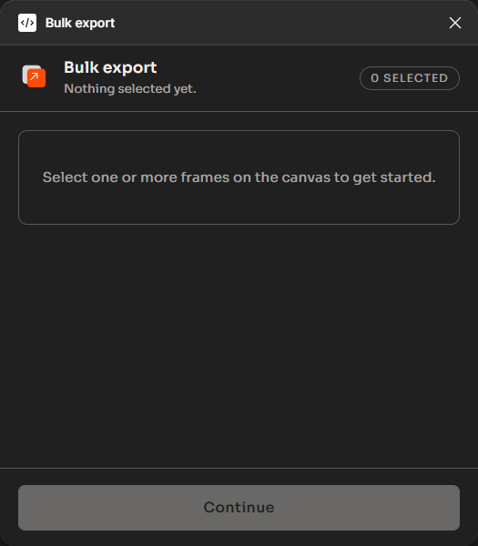
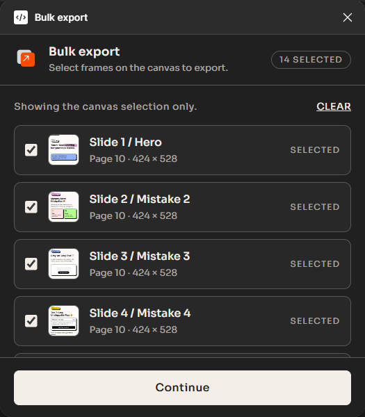
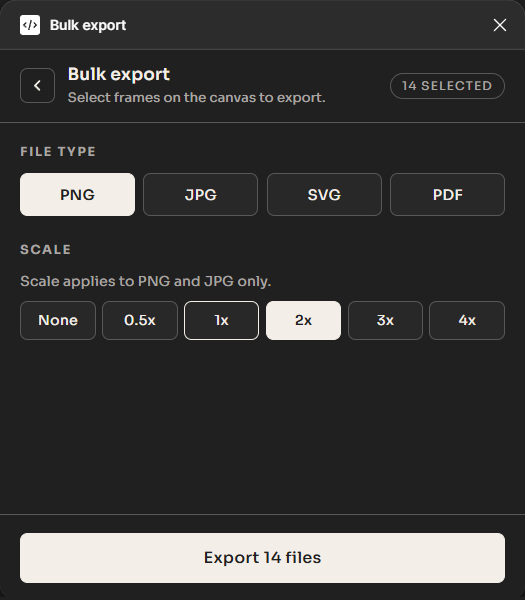
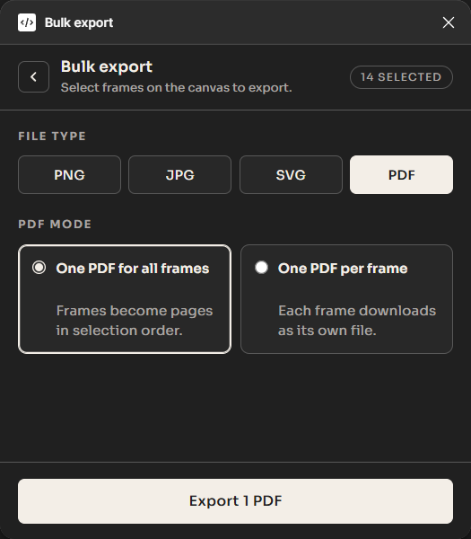

# Bulk export

Export the frames you select on the canvas as PNG, JPG, SVG, PDF, or standalone HTML. No build step, no network, plain JavaScript.

## Previews

| 1. Empty State | 2. Selection & Previews |
| :---: | :---: |
|  |  |

| 3. PNG / JPG Settings | 4. PDF Merge Settings |
| :---: | :---: |
|  |  |

## Codebase Architecture

```
Figma Export Plugins/
├── manifest.json              # Plugin manifest (Figma 1.0.0 API)
├── code.js                    # Figma sandbox main thread (concurrent export pool & cancelable thumbnails)
├── ui.html                    # Offline standalone distribution bundle
├── build_ui.js                # Assembly script combining src/ui/ and vendor/ into ui.html
├── README.md                  # Plugin documentation
├── vendor/
│   ├── jszip.min.js           # JSZip 3.10.1 (MIT)
│   └── pdf-lib.min.js         # pdf-lib 1.17.1 (MIT)
├── assets/
│   ├── logo.svg               # Vector brand mark
│   └── screenshots/           # Documentation images
└── src/
    └── ui/
        ├── styles/
        │   ├── theme.css      # Design tokens, light & dark theme variables
        │   └── main.css       # Layout, components, buttons, focus outlines
        ├── templates/
        │   ├── head.html      # Meta, fonts, and header shell
        │   └── body.html      # App structure (Select, Settings, Progress views)
        └── js/
            ├── state.js       # App state, demo fallback, file planning
            ├── thumbnails.js  # Lazy loading observer & blob URL lifecycle
            ├── ui-renderer.js # List rendering, in-place toggling, settings sync
            ├── exporter.js    # Export dispatcher & IPC file collector
            ├── packaging.js   # Fast STORE/DEFLATE zip creation & downloads
            ├── pdf-merger.js  # pdf-lib multi-page document merger
            └── main.js        # Event listeners, theme detection, app boot
```

## Build command

If you modify source files in `src/ui/` or assets in `vendor/`, recompile the standalone `ui.html` bundle with:

```bash
node build_ui.js
```

The script inlines the modular HTML, CSS, JavaScript parts, and vendor libraries into `ui.html`.

## Import via manifest

1. In Figma desktop app: Plugins > Development > Import plugin from manifest.
2. Select the `manifest.json` in this folder.
3. On the canvas, select the frames you want.
4. Run: Plugins > Development > Bulk export.
5. The plugin lists only that selection with thumbnail previews. Uncheck anything to skip it, Continue, pick format/scale, and Export. Selecting a single frame unlocks a standalone, pixel-perfect HTML export option.
6. After export the plugin stays on the done screen. Back or Export more returns to the selection (refreshed).

## Notes and limits

- **Live Previews**: Selected frames render miniature visual thumbnails in the list via lazy viewport loading.
- **Canvas Selection Tracking**: The list mirrors your canvas selection only. Non-frame layers are counted and skipped with one hint line.
- **Single-Frame HTML Export**: When exactly 1 frame is selected, an **HTML** format button appears in the format picker. It exports the frame as a self-contained, responsive HTML5 file (`.html`) with 1:1 vector precision and outlined text, requiring zero external web fonts, CDNs, or network requests.
- **Raster Scaling**: PNG and JPG support None, 0.5x, 1x, 2x, 3x, and 4x. SVG, PDF, and HTML ignore scale.
- **Side-by-side PDF Options**:
  - *One PDF for all frames*: Figma returns single-page PDFs per frame and merges them into one `frames.pdf` in selection order with pdf-lib. If a vector page fails to parse, it falls back to zipping individual PDFs safely.
  - *One PDF per frame*: Each frame downloads as its own individual PDF.
- **Naming & Packaging**: 1 file (including standalone HTML, single PDF, or single image) downloads directly; 2+ files zip cleanly with JSZip (using STORE mode for instant downloads on compressed raster formats).
- **Theming**: Native Figma theming (`figma-light` / `figma-dark`) with system `prefers-color-scheme` fallback.
- **Offline**: Zero network dependencies, zero telemetry. Fully sandboxed and secure.
